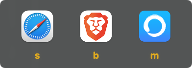

# Eligere

[](https://www.swift.org)
[](https://www.apple.com/macos)
[](https://developer.apple.com/xcode/swiftui/)
[](https://brew.sh)
[](https://github.com/RomanVolkov/eligere_app/releases)
[](LICENSE)
[](https://youtu.be/mFFS-WRaYBE)

<p align="center">
    
</p>

<p align="center">
    <a href="https://youtu.be/mFFS-WRaYBE">
        
    </a>
    <br>
    <em>▶️ Watch the demo on YouTube</em>
</p>

Eligere is a macOS app that routes links to the right browser based on rules you define. Instead of a single default browser, you get per-domain and per-app routing.

## Features

- **TOML configuration** — define routing rules in a plain text file, no complex UI
- **Domain matching** — open specific domains in specific browsers
- **Source app matching** — route links from Slack, Messages, or any app to a designated browser
- **Keyboard shortcuts** — assign a single key to each browser for quick selection
- **Tracking removal** — strip `utm_*`, `gclid`, `fbclid`, and `attribution_id` from URLs automatically
- **URL expansion** — resolve shortened URLs before routing
- **Browser profiles** — specify Chrome profiles or Firefox profiles (e.g., `profile = "Work"`)
- **Browser pinning** — hold Shift + shortcut to temporarily lock a browser for `pinningSeconds`
- **URL routing tester** — test any URL against your config to see which browser it would open
- **Auto browser detection** — on first launch, detects installed browsers and generates a starter config
- **Background agent** — tracks the active application so Eligere knows the source app of a link

## Installation

### Homebrew

```bash
brew tap romanvolkov/eligere
brew trust --tap romanvolkov/eligere
brew install --cask eligere
```

### Manual

Download the latest DMG from the [releases page](https://github.com/RomanVolkov/eligere_app/releases).

### First launch

After installation, open Eligere. On first launch, it scans `/Applications` for browsers and generates a starter config. Then set Eligere as the default browser:

1. Open Eligere
2. Click **Make default browser** in the app window
3. Or go to System Settings > General > Default Web Browser and select Eligere

## Configuration

The config file is at `~/.config/eligere/.eligere.toml`.

```toml
useOnlyRunningBrowsers = false
stripTrackingAttributes = true
expandShortenURLs = true
pinningSeconds = 30
logLevel = "warning"

[[browsers]]
name = "Safari"
shortcut = "s"
apps = ["Messages"]
domains = ["apple.com"]

[[browsers]]
name = "Arc"
shortcut = "a"
apps = ["Slack"]
domains = ["github.com"]

[[browsers]]
name = "Google Chrome"
profile = "Work"
shortcut = "c"
default = true
```

See [docs/config.md](docs/config.md) for the full reference.

### Using profiles

Chrome and Firefox support browser profiles:

```toml
[[browsers]]
name = "Google Chrome"
profile = "Default"
shortcut = "c"
domains = ["github.com"]

[[browsers]]
name = "Google Chrome"
profile = "Personal"
shortcut = "p"
default = true
```

## Testing your config

Open Eligere and use the **URL Routing Tester** in the app window. Paste a URL to see which browser would be used and what rule matched, without opening anything.

## How it works

1. You click a link outside of any browser
2. macOS opens Eligere (registered as the default browser)
3. Eligere checks the config against the URL and the source app
4. The link opens in the matching browser
5. Eligere quits — it runs only when needed

## Repository structure

```
EligereApp/
├── EligereApp.xcodeproj/          # Xcode project
├── EligereApp/                    # Main app source
│   ├── Configs/                   # TOML config parsing
│   ├── Models/                    # App state, browser model
│   ├── Views/                     # SwiftUI views
│   ├── Utils/                     # URL cleaning, logging
│   ├── URLOpener.swift            # Opens URLs in selected browser
│   └── URLRouter.swift            # Routing logic
├── Eligere Agent/                 # Background process for app tracking
├── EligereTests/                  # Swift Testing suite (swift test)
├── scripts/
│   ├── build_dmg.sh               # DMG build script
│   ├── bump-version.sh            # Version bumper
│   └── release.sh                 # Full release flow
└── docs/                          # Documentation and images
```

## Running tests

```bash
cd EligereTests && swift test
```

## Troubleshooting

Enable verbose logging in the config:

```toml
logLevel = "debug"
```

Then check `~/.eligere.log` or use **Copy log path** in the app. Report issues on [GitHub](https://github.com/RomanVolkov/eligere_app/issues).

## License

MIT. See [LICENSE](LICENSE).
