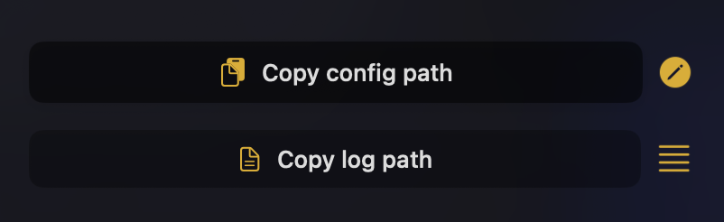

# Configuration

The app can be configured by changing values in TOML-based configuration file. The config file is located under your home directory ` ~/.config/eligere/.eligere.toml`.


If it is not that easy for you to find and edit the config via terminal - you can use <code>Copy config path</code> button and <code>edit config</code> button near right from the main view.




When you run the app for the first time - it will copy `default.toml` as example and scaffold for you for inspiration to change. Once the app is launched - you can edit the config like you want.
<!--  -->

```toml
useOnlyRunningBrowsers = false
stripTrackingAttributes = true
expandShortenURLs = true
pinningSeconds = 30
logLevel = "warning"

[[browsers]]
name = "Safari"
shortcut = "s"
apps = ["Messages"]
domains = ["apple.com"]
```
<!--  -->


# Global properties

There are properties defined on the first level and some defined inside `browsers[<index>]` level.

If there is a problem with parsing a configuration - the error will be written inside the log with `error` level. For some information please follow [troubleshooting guide](/docs/troubleshooting/logs)


## <code>useOnlyRunningBrowsers</code>
*possible values:* <code>true/false</code>

When the value is `true` - UI popover to select a browser will be filtered and show only the apps that are launched already. E.g., if you define 3 browsers and only 2 are running - with this property turned on the UI will show only these 2 options.

## <code>stripTrackingAttributes</code>
*possible values:* <code>true/false</code>

Eligere can remove some tracking parameters from URLs. Currently supported parameter prefixes are `"utmn_", "utm_", "gclid", "fbclid", "attribution_id"`. If they are exist in the URL - Eligere can remove them before proxy URL into destination web browser.

<!--  -->
If <code>expandShortenURLs</code> is set to <code>true</code> as well - stripping will be applied twice: to shortened URL and to the destination one.

It cannot track prevent you from being tracked by URL shorteners as they track while expanding the URL, but you can get rid of some others

<!--  -->

## <code>expandShortenURLs</code>
*possible values:* <code>true/false</code>

When set to <code>true</code> Eligere will reach the destination URL under the shorten one. This is useful in combination with <code>stripTrackingAttributes</code>. Eligere "expands" the URL, takes the destination one, than it can remove tracking attributes, and then proxy it into web browser.

## <code>pinningSeconds</code>
*possible values:* number of seconds starting from <code>1</code>

This values defines number of seconds selected browser will behave like a default one. Once you open a browser via shortcut or with mouse click holding <code>Shift</code> key - a browser will be pinned for <code>pinningSeconds</code> time. It means that all unknown URLs will be automatically open in selected browser during <code>pinningSeconds</code> timeframe. Once this timeframe is over - Eligere will start to show you a UI pop-up to select a browser.

In case <code>browser::default</code> is defined - this property does not make any difference as browser selection UI won't  be shown at all.

## <code>logLevel</code>
*possible values:* <code>debug/warning/error/critical</code>

This one defines the level of details the app writes into log. Default levels is set to <code>warning</code>, which means <code>warning</code>, <code>error</code> and <code>critical</code> messages will be logged.

It is not recommended to use <code>debug</code> unless you need to send the logs to devs to, well, debug some issues with your setup.

<!--   description="For some information please follow troubleshooting guide" -->
<!--   href="/docs/troubleshooting/logs/" -->
<!--   target="_blank" -->
<!-- >}} -->

# Browser properties

<code>browsers</code> field contains an array of objects, each represents one browser <code>Eligere</code> should use.


## <code>name</code>
**required***


String value of a browser. It should be the same as it is named inside <code>Applications/</code> folder, but without <code>.app</code> extension. E.g., for <code>Safari.app</code> the <code>name</code> property should be <code>Safari</code>. For <code>Brave</code> browser it is <code>Brave Browser</code>, unless you rename it manually.

This name is used to construct path to the app itself to be used by <code>Eligere</code>.


## <code>shortcut</code>
*optional*


Value represents a character to be used from browser selection UI. Should be 1 symbol. Having 2+ length string won't work. It could be a alphabet character like <code>"shortcut":"a"</code> or <code>"shortcut":"s"</code>; or it could be a number like <code>"shortcut":"1"</code>.


By default <code>Eligere</code> generates a <code>shortcut</code> value as first lowercased character from browser name. For <code>Safari</code> it is <code>s</code>, for <code>Google Chrome</code> it is <code>g</code>. But you can change to anything you prefer.


## <code>apps</code>
*optional*

*possible values:* string values of apps.


You can make a mapping between a source app from where you open an URL and a browser. E.g., you want all links from Slack go into the same browser no matter of other <code>domains</code> rule. <code>apps</code> contains an array of app's name. The name should be the same as it is inside <code>/Applications/</code> folder. E.g., <code>"Slack"</code>, <code>"Discord"</code>, <code>kitty</code>

**<code>apps</code> has higher priority than <code>domains</code>**. E.g., you open <code>github.com</code> from Slack and you have a rule for Slack - <code>github.com</code> will be opened in a browser that has Slack inside <code>apps</code> ignoring if <code>github</code> is added into <code>domains</code> somewhere else.

**Example**
```toml
    apps = ["Discord", "Telegram"]
```

## <code>domains</code>
*optional*

*possible values:* string values of domains with paths.

Currently only domains with paths are supported, no wild-cards. You can map a domain with corresponding path (if needed) to be opened in a specific browser. Supported all domain levels, even <code>com</code> can be used as rule.

**Example**
```toml
domains = [
    "youtube.com",
    "github.com/org1/somerepo"
]
```

Just use **only** domains with paths, do not use protocol like <code>http(s)://</code>. It will not work then.

## <code>default</code>
*optional*

*possible values:* <code>true/false</code>

A browser can be defined as default one. All unknown URLs will be redirected into the browser with <code>default == true</code>. In that case you won't see a browser selection UI. It is useful when you use one browser most of the time, but you need others for a specific needs. E.g., you can declare a browser for localhost
```toml
[[browsers]]
shortcut = "m"
name = "Min"
default = true
domains = ["localhost"]
```


## <code>hidden</code>
*optional*

*possible values:* <code>true/false</code>

When <code>hidden</code> is set to <code>true</code> - the browser will be used to process domains from <code>domains</code> array, but it won't be shown at browser selection UI.

**Example**
```toml
[[browsers]]
shortcut = "m"
name = "Min"
hidden = true
domains = ["localhost"]


```
<code>false</code>


<code>true</code>


But if you will try to open <code>localhost</code> - <code>Min</code> will be opened anyway as it's defined inside <code>domains</code>


## <code>arguments</code>
*optional*


*possible values:* <code>array of strings</code>

This is the proxy for [NSWorkspace.OpenConfiguration](https://developer.apple.com/documentation/appkit/nsworkspace/openconfiguration/arguments) that allows to pass additional launch parameters into the browser. From documentation: 
> If the calling process is sandboxed, the system ignores the value of this property.

Eligere has no control over it, it just passed the values.

Example:
```toml
arguments = ["arg1", "--arg2"]
```
