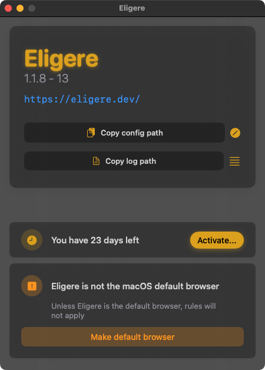
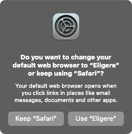
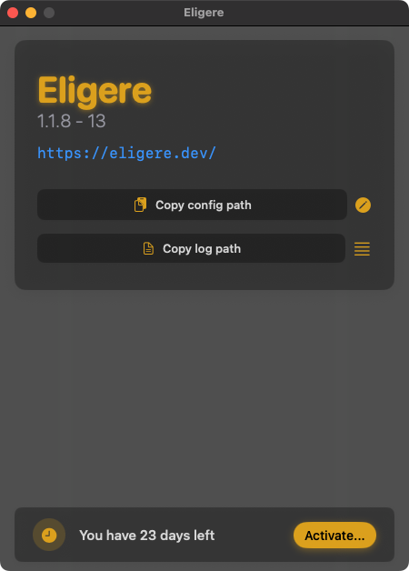

# First launch

During the first launch you need to select the app as default web browser, otherwise it won't work. <code>Eligere</code> serves as default web browsers so then it can redirect into something different automatically or by your selection via UI.

<code>Eligere</code> tells you when it's not selected as default web browser.

Use <code>Make default browser</code> button, which will trigger macOS standard dialog to select a browser.

Choose <code>Eligere</code>.

Once <code>Eligere</code> is default one - you won't see bottom banner anymore, unless you change the default web browser to something different.

### Generated configuration

There is no way to understand that an app is a web browser. Basically, on macOS everything that can handle opening of http(s) links can be a candidate to be a default web browser. First time you launch an application - it will generate first config using default values and placing all apps that can handle http(s) links.

You can read more about the config [here](/docs/config/info/)
